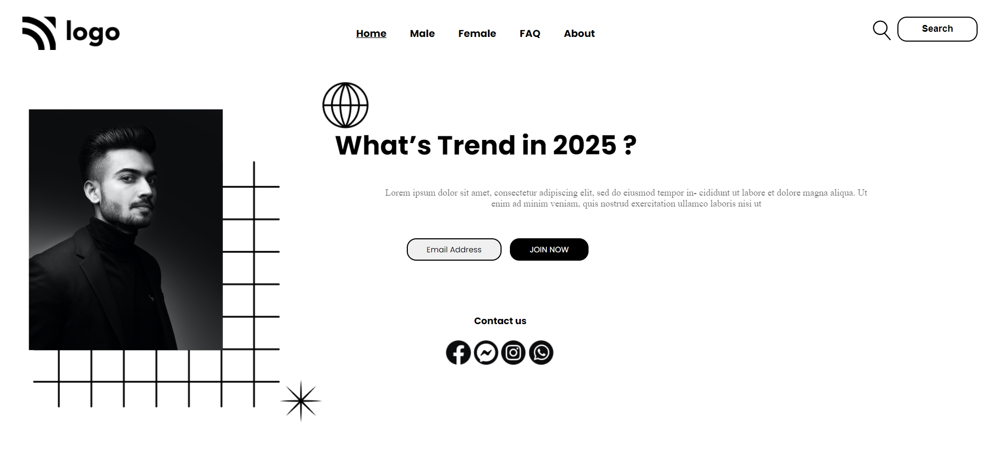

# Street Style Landing Page

> I have learnt about basics of HTML and CSS.It was a challenging for me as its a first project i have built after 1 year.now i am feeling little comfortable.

> i have built it using CSS flex box and positioning properties.

> It took me around 3 hrs to finished this project

---

Take a look at the sample output page and click on below link to check it on web.

[Link](https://firstlandingpage1.netlify.app/)

